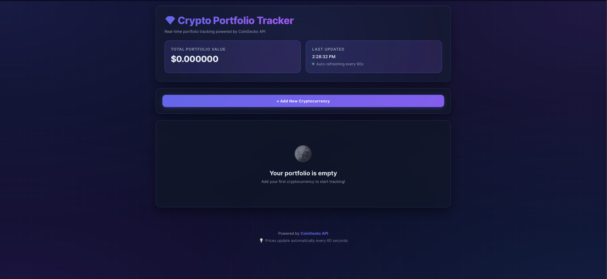

# 🪙 Crypto Portfolio Tracker


A real-time cryptocurrency portfolio tracker built with React and CoinGecko API. Track your crypto investments, monitor live prices, and visualize your portfolio performance.

## 🌟 Features

- 💰 **Real-time Price Tracking**: Live crypto prices via CoinGecko API
- 📊 **Portfolio Valuation**: Automatic calculation of total portfolio worth
- 📈 **Price Change Indicators**: 24h price changes with visual indicators
- 🔄 **Auto-refresh**: Prices update automatically every 60 seconds
- 🎨 **Modern UI**: Clean, responsive design with glassmorphism effects
- 📱 **Mobile Responsive**: Works seamlessly on all devices
- 💾 **Persistent Storage**: Your portfolio is saved locally

## 🛠️ Tech Stack

- **Frontend**: React.js
- **API**: CoinGecko API (Free tier)
- **Styling**: CSS3 with custom animations
- **State Management**: React Hooks (useState, useEffect)
- **Storage**: LocalStorage for data persistence

## 🚀 Quick Start

### Prerequisites

- Node.js (v14 or higher)
- npm or yarn

### Installation

1. Clone the repository:
```bash
git clone https://github.com/yourusername/FUTURE_BC_02.git
cd FUTURE_BC_02
```

2. Install dependencies:
```bash
npm install
```

3. Start the development server:
```bash
npm start
```

4. Open [http://localhost:3000](http://localhost:3000) in your browser

## 📖 Usage

1. **Add a Coin**: Enter the cryptocurrency ID (e.g., bitcoin, ethereum), the amount you own, and the price you bought at
2. **View Portfolio**: See your holdings with current prices, 24h changes, and total value
3. **Remove Coins**: Click the delete button to remove coins from your portfolio
4. **Auto-refresh**: Prices update automatically every 60 seconds

## 🎯 API Integration

This project uses the [CoinGecko API](https://www.coingecko.com/en/api) (free tier):

- **Endpoint**: `/api/v3/simple/price`
- **Rate Limit**: 10-30 calls/minute (Free tier)
- **No API Key Required**

### Popular Coin IDs:
- Bitcoin: `bitcoin`
- Ethereum: `ethereum`
- Cardano: `cardano`
- Solana: `solana`
- Polkadot: `polkadot`

## 📸 Screenshots


*Main dashboard with portfolio overview*


*Add new cryptocurrency to your portfolio*

## 🧠 Skills Demonstrated

- ✅ RESTful API integration
- ✅ Asynchronous JavaScript (async/await)
- ✅ React component architecture
- ✅ State management with Hooks
- ✅ LocalStorage for data persistence
- ✅ Responsive web design
- ✅ Error handling and user feedback
- ✅ Real-time data updates

## 🎓 Learning Outcomes

Through this project, I gained hands-on experience with:

1. **API Integration**: Working with third-party APIs, handling responses, and managing rate limits
2. **React Development**: Component lifecycle, hooks, and state management
3. **Financial Calculations**: Computing portfolio values, profit/loss, and percentage changes
4. **UX Design**: Creating intuitive interfaces for financial data
5. **Data Persistence**: Implementing localStorage for client-side data storage

## 🔮 Future Enhancements

- [ ] Add wallet address integration
- [ ] Pie chart visualization for portfolio distribution
- [ ] Price alerts and notifications
- [ ] Historical portfolio performance graph
- [ ] CSV export functionality
- [ ] Dark/Light theme toggle
- [ ] Multiple portfolio support

## 📝 License

This project is licensed under the MIT License - see the LICENSE file for details.

## 🤝 Contributing

Contributions, issues, and feature requests are welcome! Feel free to check the issues page.

## 👨‍💻 Author

**Your Name**
- GitHub: [@yourusername](https://github.com/yourusername)
- LinkedIn: [Your LinkedIn](https://linkedin.com/in/yourprofile)

## 🙏 Acknowledgments

- CoinGecko for providing the free cryptocurrency API
- React team for the amazing framework
- Future Skills BC program for the learning opportunity

---

⭐ If you found this project helpful, please give it a star!
